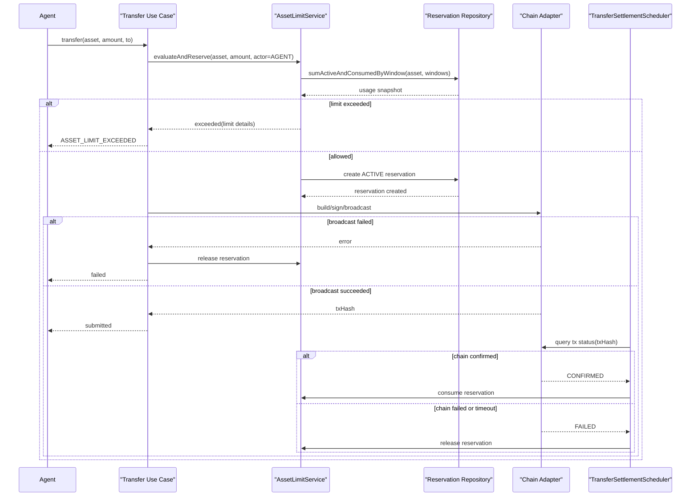

# 06 钱包领域模型与核心用例

## 1. 文档目的

本文档定义钱包领域模型、状态规则和关键业务用例。目标是稳定业务语义，让开发不依赖 UI 或接口实现来理解钱包逻辑。

## 2. 领域核心

本期只有一个核心领域对象：`Current Wallet`。

这是一个单钱包系统，不存在：

- 多钱包列表
- 钱包切换
- 钱包分组
- 子账户

## 3. 核心领域对象

### 3.1 `WalletAggregate`

字段概念：

- `walletId`
- `fingerprint`
- `source`
- `status`
- `encryptedPrivateKeyRef`
- `createdAt`
- `updatedAt`

状态：

- `ACTIVE`
- `EMPTY`

### 3.2 `OwnerCredential`

字段概念：

- `credentialId`
- `passwordHash`
- `mustRotate`
- `createdAt`
- `updatedAt`

### 3.3 `TransferOperation`

字段概念：

- `operationId`
- `actorRole`
- `chain`
- `asset`
- `status`
- `txHash`
- `errorCode`
- `errorMessage`

状态机：

- `RESERVED`
- `SUBMITTED`
- `CONFIRMED`
- `FAILED`

### 3.4 `AuditLog`

字段概念：

- `auditId`
- `actorRole`
- `action`
- `result`
- `metadata`
- `createdAt`

### 3.5 `AssetLimitPolicy`

字段概念：

- `policyId`
- `chain`
- `asset`
- `dailyLimit`
- `weeklyLimit`
- `monthlyLimit`
- `updatedBy`
- `createdAt`
- `updatedAt`

说明：

- 金额单位统一使用币种最小单位整数字符串
- `null` 表示该周期不限额

### 3.6 `AssetLimitReservation`

字段概念：

- `reservationId`
- `operationId`
- `actorRole`
- `chain`
- `asset`
- `amount`
- `dailyWindowStart`
- `weeklyWindowStart`
- `monthlyWindowStart`
- `status`
- `releaseReason`
- `createdAt`
- `updatedAt`
- `settledAt`

状态：

- `ACTIVE`
- `CONSUMED`
- `RELEASED`

### 3.7 `AssetLimitUsageSnapshot`

字段概念：

- `chain`
- `asset`
- `dailyConsumed`
- `weeklyConsumed`
- `monthlyConsumed`
- `dailyReserved`
- `weeklyReserved`
- `monthlyReserved`
- `dailyResetsAt`
- `weeklyResetsAt`
- `monthlyResetsAt`

说明：

- `effectiveUsed = consumed + reserved`
- Agent 限额判断必须基于 `effectiveUsed`

## 4. 核心业务规则

### 4.1 单钱包规则

- 系统中永远只有一个“当前钱包”
- 任何查询都面向当前钱包
- Owner 导入新私钥时直接替换当前钱包
- 不保留历史钱包切换能力

### 4.2 风险控制规则

- 风险控制依赖资金隔离
- 不依赖细粒度能力开关
- Agent 可自由使用已暴露能力
- Owner 拥有最终接管能力

### 4.3 私钥暴露规则

- Agent 永远不可获取私钥明文
- Owner 仅在明确导出流程中可获得私钥明文
- 系统不在普通查询或调试接口中返回私钥相关内容

### 4.4 币种限额规则

- 限额由 server 执行
- 限额只对 `AGENT` 生效
- `OWNER` 不受限额约束
- 限额按币种独立配置
- 限额周期固定为 `DAILY`、`WEEKLY`、`MONTHLY`
- 限额按 server 本地时区重置
- Agent 不可主动读取限额配置，仅在触发时收到结构化 `limit` 信息

### 4.5 额度预占与结算规则

- Agent 转账在进入链适配器前必须先完成额度预占
- 额度判断口径必须使用当前窗口内的 `CONSUMED + ACTIVE`
- 额度预占只在短事务内持有锁，不等待链上确认
- 广播成功后，预占继续保持 `ACTIVE`
- 链上确认成功后，预占变为 `CONSUMED`
- 广播失败、链上失败或超时后，预占变为 `RELEASED`

### 4.6 操作状态与链上状态区分规则

- `wallet.operation_status` 表示 server 本地操作状态
- `nervos.tx_status` 与 `ethereum.tx_status` 表示链上观察状态
- 本地操作状态和链上状态不是同一个概念，不能互相替代
- 后台结算任务必须复用与 MCP 相同的链上 `tx status` 查询能力

## 5. 核心用例

### 5.1 启动自动建钱包

触发条件：

- 系统启动且无当前钱包

步骤：

1. 生成新私钥
2. 推导多链身份
3. 加密私钥
4. 持久化为当前钱包
5. 写审计或启动记录

结果：

- 系统启动后立即可用

### 5.2 查询当前钱包

输入：

- 无

输出：

- 当前钱包状态
- 钱包来源
- 钱包指纹

### 5.3 查询多链身份

输出：

- CKB 地址
- ETH 地址

### 5.4 查询 CKB 余额

输出：

- `chain`
- `asset`
- `amount`
- `decimals`

### 5.5 查询 ETH 余额

输出：

- `chain`
- `asset`
- `amount`
- `decimals`

### 5.6 查询 USDT 余额

输出：

- `chain`
- `asset`
- `amount`
- `decimals`

### 5.7 查询 USDC 余额

输出：

- `chain`
- `asset`
- `amount`
- `decimals`

### 5.8 消息签名

输入：

- message

步骤：

1. 取当前钱包
2. 解密私钥
3. 调用对应链签名能力
4. 返回签名
5. 写审计

### 5.9 CKB 转账

步骤：

1. 校验参数
2. 加载当前钱包
3. 若 `actorRole=AGENT`，获取 `wallet + ckb + ckb` 额度锁
4. 若 `actorRole=AGENT`，执行 `CKB` 限额评估并创建额度预占
5. 获取 `ckb` 写锁
6. 构建交易
7. 签名
8. 广播
9. 广播成功则写入 `txHash` 并更新为 `SUBMITTED`
10. 广播失败则更新为 `FAILED` 并释放额度预占

### 5.10 Ethereum ETH 转账

步骤：

1. 校验参数
2. 加载当前钱包
3. 若 `actorRole=AGENT`，获取 `wallet + ethereum + eth` 额度锁
4. 若 `actorRole=AGENT`，执行 `ETH` 限额评估并创建额度预占
5. 获取 `evm` 写锁
6. 构建 ETH 转账交易
7. 签名
8. 广播
9. 广播成功则写入 `txHash` 并更新为 `SUBMITTED`
10. 广播失败则更新为 `FAILED` 并释放额度预占

### 5.11 Ethereum USDT 转账

步骤：

1. 校验参数
2. 加载当前钱包
3. 若 `actorRole=AGENT`，获取 `wallet + ethereum + usdt` 额度锁
4. 若 `actorRole=AGENT`，执行 `USDT` 限额评估并创建额度预占
5. 获取 `evm` 写锁
6. 构建 USDT 转账交易
7. 签名
8. 广播
9. 广播成功则写入 `txHash` 并更新为 `SUBMITTED`
10. 广播失败则更新为 `FAILED` 并释放额度预占

### 5.12 Ethereum USDC 转账

步骤：

1. 校验参数
2. 加载当前钱包
3. 若 `actorRole=AGENT`，获取 `wallet + ethereum + usdc` 额度锁
4. 若 `actorRole=AGENT`，执行 `USDC` 限额评估并创建额度预占
5. 获取 `evm` 写锁
6. 构建 USDC 转账交易
7. 签名
8. 广播
9. 广播成功则写入 `txHash` 并更新为 `SUBMITTED`
10. 广播失败则更新为 `FAILED` 并释放额度预占

### 5.13 Owner 配置币种限额

步骤：

1. Owner 登录
2. 选择 `chain + asset`
3. 输入日、周、月限额
4. 校验金额格式
5. 写入或更新限额配置
6. 写审计

### 5.14 Agent 转账触发限额

步骤：

1. Agent 发起转账
2. server 获取对应 `wallet + chain + asset` 额度锁
3. server 按币种和周期计算当前 `consumed + reserved`
4. 与请求金额进行比较
5. 若超限，返回 `ASSET_LIMIT_EXCEEDED`
6. 返回结构化 `limit` 信息
7. 写审计与失败操作记录

### 5.15 Agent 转账异步结算

步骤：

1. 后台任务扫描 `RESERVED` 与 `SUBMITTED` 操作
2. `RESERVED` 超过短超时仍未广播成功，则标记 `FAILED`
3. 与之关联的额度预占更新为 `RELEASED`
4. `SUBMITTED` 操作按链查询当前 `tx status`
5. 若链上确认成功，更新操作为 `CONFIRMED`
6. 与之关联的额度预占更新为 `CONSUMED`
7. 若链上失败或确认超时，更新操作为 `FAILED`
8. 与之关联的额度预占更新为 `RELEASED`

### 5.16 查询 CKB 链上交易状态

步骤：

1. 调用 `nervos.tx_status`
2. 按 `txHash` 查询当前链上状态
3. 返回 `NOT_FOUND`、`PENDING`、`CONFIRMED` 或 `FAILED`

### 5.17 查询 Ethereum 链上交易状态

步骤：

1. 调用 `ethereum.tx_status`
2. 按 `txHash` 查询当前链上状态
3. 返回 `NOT_FOUND`、`PENDING`、`CONFIRMED` 或 `FAILED`

### 5.18 Owner 导入恢复

步骤：

1. Owner 登录
2. 输入私钥
3. 校验格式
4. 推导身份
5. 加密私钥
6. 替换当前钱包
7. 写审计

### 5.19 Owner 导出私钥

步骤：

1. Owner 登录
2. 风险确认
3. 解密私钥
4. 返回明文
5. 写审计

## 6. 失败路径

必须显式处理：

- 钱包不存在
- 私钥导入格式错误
- `KEK` 不可用
- RPC 不可达
- 余额不足
- Agent 触发资产限额
- 额度预占成功后进程崩溃
- 已广播交易长时间未确认
- 链上交易失败后额度未返还
- CKB 组交易失败
- ETH 转账广播失败
- EVM 资产余额查询失败
- USDT 转账广播失败
- USDC 转账广播失败
- CKB `tx status` 查询失败
- Ethereum `tx status` 查询失败
- 导出过程失败

## 7. 领域结论

本期钱包领域的本质不是“一个通用钱包”，而是：

`一个可被 Agent 自主使用、可被 Owner 后置接管、由单私钥承载多链身份、资产操作和 server 侧风险限额的单钱包信用账户。`
