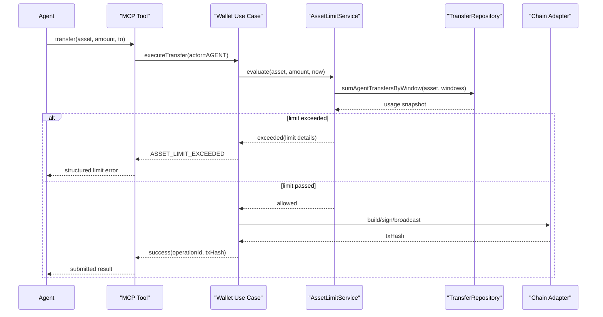

# ADR 0001 币种限额执行模型

## 状态

Accepted

## 日期

2026-03-12

## 背景

最新产品基线新增了两项约束：

- Ethereum 侧新增 `USDC`
- server 侧新增“按币种独立的日、周、月限额”

这组需求有几个关键特征：

- 限额是风险控制能力，不是 Agent 能力
- Owner 需要在 UI 中配置限额
- Agent 平时不应感知限额配置
- Agent 仅在触发限额时收到明确的 `limit` 信息
- Owner 不受同一套限额约束
- 限额按 server 本地时区重置

因此需要明确：限额在哪一层执行、如何计数、如何向 Agent 返回错误、如何避免把复杂度扩散到 UI 和 Agent 侧。

## 决策

### 1. 限额由 server 在转账前执行

限额检查发生在应用层转账编排中，顺序固定为：

1. 校验输入
2. 解析 actor
3. 如果 actor 为 `AGENT`，执行限额评估
4. 通过后再进入链适配器
5. 不通过则直接返回 `ASSET_LIMIT_EXCEEDED`

### 2. 限额按币种独立配置

本期限额对象固定为：

- `CKB`
- `ETH`
- `USDT`
- `USDC`

每个币种各自拥有：

- `dailyLimit`
- `weeklyLimit`
- `monthlyLimit`

金额单位统一使用该币种的最小单位整数字符串。

### 3. Owner 不受限额约束

限额只用于约束 Agent 风险敞口。

Owner 是人工接管与兜底角色，因此：

- Owner 转账不做限额拦截
- Owner 可以查看和修改限额配置
- Owner 的限额配置动作必须审计

### 4. v1 不引入独立计数器表

v1 使用 `transfer_operations` 作为限额计数的事实来源。

计数口径：

- 只统计 `actorRole=AGENT`
- 只统计已经提交成功或后续确认成功的转账
- 不统计构建失败、广播失败或被限额拦截的请求

原因：

- 本地 SQLite 单机场景吞吐很低
- 查询聚合成本可接受
- 先保证行为正确，避免过早引入预计算和重置任务复杂度

### 5. 限额周期按 server 本地时区计算

重置口径：

- 日限额：每天 `00:00`
- 周限额：每周一 `00:00`
- 月限额：每月 `1 日 00:00`

系统直接使用 server 本地时区。

部署要求：

- 运维必须显式设置 `TZ`
- 文档和日志必须明确当前时区

### 6. Agent 只在触发时收到结构化 limit 信息

触发限额时，返回：

- 错误码 `ASSET_LIMIT_EXCEEDED`
- 被触发的资产与周期
- `limitAmount`
- `usedAmount`
- `requestedAmount`
- `remainingAmount`
- `resetsAt`

不提供 Agent 主动查询限额的接口。

## 时序

## 结果

这项决策带来的直接结果是：

- Agent 仍保持简单调用心智
- Owner 可以通过独立配置面管理风险
- 限额逻辑留在 server，不扩散到 UI 或 Agent
- 数据模型和错误模型都能稳定支持后续实现

## 后续影响

开发时必须同步更新：

- `design/contracts/mcp-and-owner-interfaces.md`
- `design/architecture/04-modules-and-runtime.md`
- `design/architecture/06-wallet-domain-and-use-cases.md`
- `design/architecture/08-data-and-persistence.md`
- `design/architecture/10-deployment-and-operations.md`
- `design/architecture/12-implementation-roadmap.md`
- `design/architecture/13-development-requirements-and-quality-gates.md`
