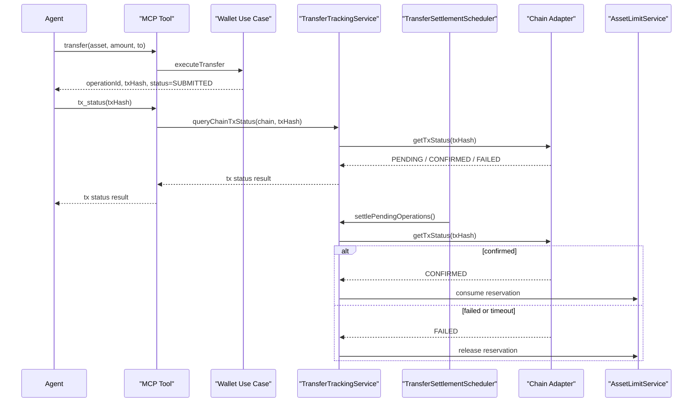

# ADR 0002 转账结算与链上状态跟踪

## 状态

Accepted

## 日期

2026-03-12

## 背景

钱包转账闭环新增了两个明确要求：

- Agent 在发起转账后，需要主动查询交易是否已经成功上链
- server 内部需要在链确认异步完成后，结算操作状态并确认或返还额度预占

现有 `wallet.operation_status` 只能表达本地操作编排状态，不能代替链上状态查询。

同时，本系统还必须满足：

- `CKB` 与 `Ethereum` 都提供交易状态查询能力
- MCP 和内部后台任务复用同一套链上状态解释逻辑
- 进程重启后，未结算的操作仍可恢复

因此需要明确：交易状态查询能力如何对外暴露，后台如何结算，以及本地状态与链上状态如何区分。

## 决策

### 1. 本地操作状态与链上状态分开建模

`wallet.operation_status` 继续表示 server 本地操作状态。

正式状态为：

- `RESERVED`
- `SUBMITTED`
- `CONFIRMED`
- `FAILED`

链上状态由按链工具单独提供：

- `nervos.tx_status`
- `ethereum.tx_status`

正式链上状态为：

- `NOT_FOUND`
- `PENDING`
- `CONFIRMED`
- `FAILED`

### 2. 两条链都提供按 `txHash` 查询状态的 MCP 能力

输入固定为：

- `txHash`

输出至少包括：

- `chain`
- `txHash`
- `status`
- `blockNumber?`
- `blockHash?`
- `confirmations?`
- `reason?`

不提供跨链通用 `wallet.tx_status`。

原因：

- 单工具单职责要求不能被破坏
- CKB 与 EVM 的状态源和解释逻辑不同
- 明确的按链工具更利于 Agent 理解和调用

### 3. 后台结算任务是正式运行时职责

系统必须运行 `TransferSettlementScheduler`。

职责：

- 扫描 `RESERVED` 操作
- 扫描 `SUBMITTED` 操作
- 查询链上状态
- 更新本地操作状态
- 确认或返还额度预占

它不是：

- 调试工具
- 只在开发环境开启的脚本
- 依赖人工触发的补偿流程

### 4. 结算任务必须复用与 MCP 相同的链上状态查询服务

正式要求：

- CKB 结算复用 `getCkbTxStatus`
- EVM 结算复用 `getEvmTxStatus`
- 不允许后台任务直接绕过适配器拼装链 SDK 查询逻辑

原因：

- 保证 MCP 与后台对同一 `txHash` 的解释一致
- 降低链状态语义分叉风险
- 让链上状态映射只有一个真相来源

### 5. `RESERVED` 与 `SUBMITTED` 的超时处理必须显式定义

必须区分：

- `RESERVED` 超时：说明预占成功后未完成广播，应直接失败并释放 reservation
- `SUBMITTED` 超时：说明交易长时间未完成最终结算，应查询链上状态并按失败路径处理

超时阈值必须由部署配置提供，而不是写死在代码里。

## 时序

## 结果

这项决策带来的直接结果是：

- Agent 可以在提交转账后主动确认链上结果
- server 可以在无人干预时完成转账结算
- `wallet.operation_status` 与链上状态职责清晰分离
- MCP 与后台任务对链状态的解释保持一致

## 后续影响

开发时必须同步更新：

- `design/contracts/mcp-and-owner-interfaces.md`
- `design/architecture/04-modules-and-runtime.md`
- `design/architecture/06-wallet-domain-and-use-cases.md`
- `design/architecture/08-data-and-persistence.md`
- `design/architecture/09-chain-integration.md`
- `design/architecture/10-deployment-and-operations.md`
- `design/architecture/12-implementation-roadmap.md`
- `design/architecture/13-development-requirements-and-quality-gates.md`
